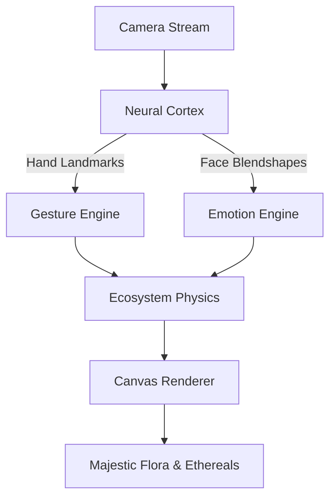

# 🌿 PHOTOSYN.soul

> **A Neural Sanctuary where Biometric Data blooms into Digital Life.**

[](https://mediapipe.dev)
[](https://solidjs.com)
[](https://github.com)

---

## ✨ The Vision

**Photosyn** is a high-fidelity digital mirror that bridges the gap between human emotion and procedural botany. Using advanced AI computer vision, it transforms your reflection into a living ecosystem — every gesture you make and every emotion you feel directly impacts the growth, color, and vitality of a digital garden.

---

## 🧠 Neural Interface

### 🖐️ Master Gestures

| Gesture | Biological Meaning | Effect |
| :--- | :--- | :--- |
| **BLOOM_PINCH** | *Sowing* | Plant a majestic single-stem flower. |
| **ROOT_FIST** | *Capture* | Grab and move Neural Synapse nodes or attract Ethereals. |
| **HEART** | *Healing* | Unleash a white light blast to rejuvenate the flora. |
| **STASIS_X** | *Suspension* | Cross your arms to freeze time in a deep cyan mist. |
| **SUN_RAY** | *Ascension* | Cup your hands to create a vertical light pillar. |

### 😊 Emotional Symbiosis

The **Neural Cortex** tracks your micro-expressions to tilt the world's physics:

| Emotion | Color | Effect |
| :--- | :--- | :--- |
| **HAPPY** | 🟡 Gold | Accelerated growth, fast-flying spirits, and warm atmosphere. |
| **SAD** | 🔵 Deep Blue | Languid movement, falling spirits, and dense melancholic mist. |
| **ANGRY** | 🔴 Crimson | High-frequency vibrations, erratic wind, and glitchy aura. |
| **SURPRISED** | 🟣 Violet | Expanded energy halos and intensified pollen. |

---

## 🛠️ Tech Stack

| Layer | Technology | Role |
| :--- | :--- | :--- |
| **Core** | [SolidJS](https://www.solidjs.com/) | Fine-grained reactivity at 60 FPS |
| **Intelligence** | [MediaPipe](https://google.github.io/mediapipe/) | Hand & Face Landmarker via WASM |
| **State** | [Zustand](https://zustand-demo.pmnd.rs/) | Vanilla JS store for high-performance state |
| **Visuals** | Canvas API | Procedural fractals, volumetric fog, angel particles |
| **Style** | Tailwind CSS | Glassmorphism & Cyber-minimalism |

---

## 🏛️ Architecture

Photosyn operates on a **Local-First** philosophy. Your biometric data never leaves your browser — all inference is computed on-device using highly optimized WASM binaries.



---

## 🚀 Getting Started

**1. Clone the seeds:**
```bash
git clone https://github.com/hiericho/photosyn.git
cd photosyn
```

**2. Nurture dependencies:**
```bash
npm install
```

**3. Awaken the sanctuary:**
```bash
npm run dev
```

Open `http://localhost:3000` and allow camera access. 🌱

---

## 📋 Requirements

- Node.js 18+
- A modern browser with WebAssembly support (Chrome, Firefox, Edge, Safari)
- A webcam

---

## 📜 Changelog

| Version | Notes |
| :--- | :--- |
| `v9.0` | Optimized Crystalline Synapse Nodes and Majestic single-bloom stems. |
| `v5.0` | Added Emotional Linkage. |
| `v1.0` | Initial seeding. |

---

## 📄 License

Distributed under the MIT License. See `LICENSE` for more information.

---

<p align="center">
  Developed with ✨ and 🌱 by <b>hiericho</b><br/>
  <i>"In the intersection of code and chlorophyll, we find our reflection."</i>
</p>
